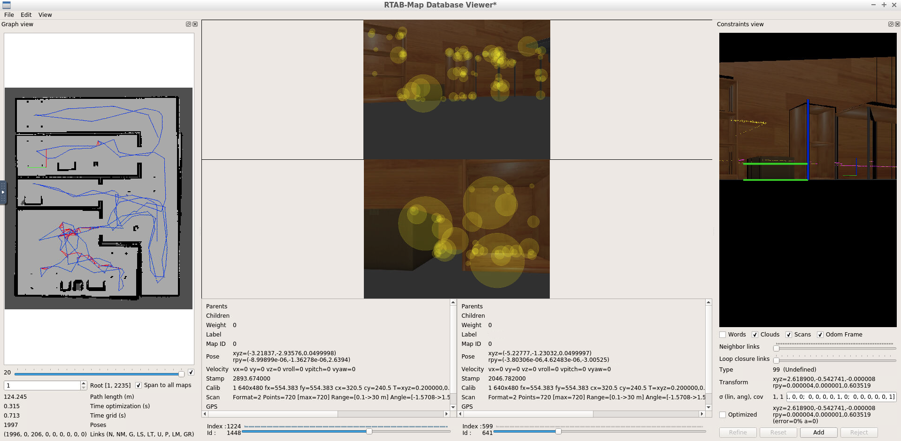

# Map_My_World
Because the map file is too large to store in github, here is the link to robot map file: https://drive.google.com/file/d/1-BiTgT23GXVv7KyyEFzrNJUxnMvakXdr/view?usp=sharing

## Basic Build Instructions
This repo contains teleop_twist_keyboard for submission per project rublic. Make sure uninstall the old teleop_twist_keyboard package in your system before proceeding.
1. Clone and build this repo using catkin_make.
2. Run world file.
```
roslaunch my_red_robot_mapping world.launch
```
3. Run mapping launch file.
```
roslaunch my_red_robot_mapping mapping.launch
```
The map will be stored in
```
<This_Package>/maps/rtabmap.db
```
4. View generated map by running
```
rtabmap-databaseViewer <Path_To_rtabmap.db>
```

Here is a snapshot from rtabmap-databaseViewer

